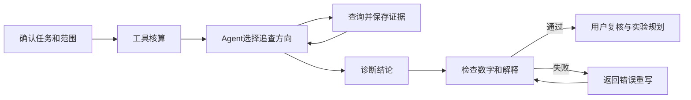

# Campaign Intelligence

营销活动复盘 Agent，面向零售及本地生活运营人员。围绕活动是否达标、转化卡在哪里、投入是否划算展开分析，减少反复取数、核对口径和追查异常的工作。

[产品设计](docs/product/01-product-brief.md) · [Agent 设计](docs/product/03-agent-design.md) · [问题与修复](docs/product/07-reviewer-guide.md) · [评测记录](docs/product/04-evaluation-plan.md)

## 产品演示

计算结果、分析判断和查询证据分开展示，用户可以直接核对结论中的数字。


<details>
<summary>查看任务配置和执行检查</summary>


</details>

截图来自实际应用；演示使用合成数据，诊断来自保存的模型运行记录，不代表真实企业的活动结果。

## 一次复盘怎么做

1. 导入活动、行为、订单和费用数据，确认日期、渠道、人群及退款口径。
2. 选择要判断的经营问题，例如是否继续活动，或转化改善后贡献额为什么下降。
3. 系统核算目标、转化路径和投入成本；Agent 根据异常选择渠道、人群或经营点追查。
4. 查看诊断和对应查询结果，区分已确认的事实与需要验证的解释。
5. 选择下一轮实验对象及主指标，测算样本量和预计周期，保存决定与复查安排。

例如，在贡献额下降的案例中，系统先比较订单规模和单均贡献，再检查优惠、直接成本及活动费用。费用缺少渠道明细时，不生成单渠道投入效率；同样，前后周期改善不直接解释为活动带来的增量。

## 核心设计

| 复盘中的问题 | 项目处理 |
|---|---|
| 模型算错金额或混用指标 | 金额、人数和转化率由查询工具计算，模型负责诊断，不重新计算经营指标 |
| 总量正常，但局部转化异常 | 先扫描趋势和分层结果，再由 Agent 选择最多三项定向复核，并记录调查理由 |
| 改了日期或人群，仍引用之前的结果 | 查询绑定数据快照及统计范围；调整范围后重新核算，历史结论保留供对照 |
| 结论无法核对，错误解释进入后续决策 | 保存 SQL、参数和指标版本；自动检查数字引用及解释，失败后返回具体错误重写，最多两次 |



实验规划支持二元转化指标、固定样本和等比例分组。另支持可选同期面板增量分析，需检查前趋势、安慰剂及干扰条件；详细适用限制见[指标说明](docs/product/02-metric-contract.md)。

## 评测和修复

开发场景共 54 条，自动检查规则共 41 项，覆盖工具调用、统计范围、数字引用、路径解读和因果表述。最新一轮 6 条代表场景通过全部检查；完整场景集尚未全部完成真实模型验证，小样本结果不代表稳定通过率。

| 发现的错误 | 具体改动 | 验证方式 |
|---|---|---|
| 将贡献额 3933 元写成 3393 元 | 按指标返回两期值和差额，检查回答后将错误数字反馈给模型 | 保留原始失败；一次模型重放通过当时 38 项检查 |
| 将路径完整性误解为行动后没有流失 | 独立返回阶段人数、相邻转化率和最低承接节点 | 查询测试及模型场景回归 |
| 将共享费用归给单一渠道 | 标明费用可归属范围，缺少明细时不计算分渠道投入效率 | 成本反例测试及回答检查 |

原始运行和失败记录见 [evals](evals/)，修改原因见[修复说明](docs/product/07-reviewer-guide.md)。自动检查用于发现已知错误，不替代业务人员复核。

## 本地体验

需要 Python 3.11+、uv、Node.js 20.19+ 和 pnpm。

```bash
git clone https://github.com/iloveme99i/campaign-intelligence-agent.git
cd campaign-intelligence-agent
uv sync --extra dev
cd frontend
pnpm install
pnpm build
cd ..
./scripts/run-merchant-local.sh
```

打开 `http://127.0.0.1:8101`，载入合成案例，在“模型与设置”中填写自己的 DeepSeek 或兼容 API 配置。密钥加密保存在本机，不要提交到仓库。示例文件及格式说明见 [sample_data](sample_data/)。

<details>
<summary>GitHub Codespaces 配置</summary>

仓库已提供 Codespaces 配置，但云端初始化尚未完成验收，不作为已上线 Demo。需要 GitHub 登录；实时诊断仍需自己的模型密钥。

[创建 Codespace](https://codespaces.new/iloveme99i/campaign-intelligence-agent?quickstart=1)

</details>

## 项目工作范围

本项目为个人产品实践，围绕活动复盘新增了任务配置、数据契约、经营核算、诊断工具、证据展示、实验规划及领域评测。设计取舍、实现位置和基础设施边界见[贡献说明](docs/product/05-build-ownership.md)。不涉及模型训练。

当前为单机单用户版本，未接入企业数据仓库和权限系统；没有真实商家上线结果或经营收益验证。项目展示以可运行功能、查询证据和回归记录为准。

## 许可证

采用 [Apache-2.0](LICENSE)。代码归属及第三方声明见 [NOTICE](NOTICE)，保留相关版权和许可证要求。
