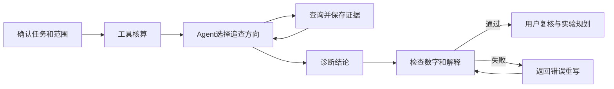

# Campaign Intelligence

面向零售及本地生活运营的营销活动复盘 Agent，整合活动、行为、交易和费用数据，核算目标达成、转化损失及经营贡献，追查渠道、人群和经营点差异，支持活动调整及后续实验规划。

[产品设计](docs/product/01-product-brief.md) · [Agent 设计](docs/product/03-agent-design.md) · [问题与修复](docs/product/07-reviewer-guide.md) · [评测记录](docs/product/04-evaluation-plan.md)

## 产品演示

界面保留指标核算、分层诊断、查询证据和执行记录，支持从分析结论回查取数范围及计算结果。


<details>
<summary>查看任务配置和执行检查</summary>


</details>

截图来自实际应用；演示使用合成数据，诊断来自保存的模型运行记录，不代表真实企业的活动结果。

## 分析流程

1. **任务配置**：明确继续、调整、扩大或停止的决策目标，设置活动期、对比期、筛选条件和退款口径。
2. **指标核算**：计算目标完成情况、同一用户的顺序转化路径、两期贡献额及活动投入，检查曝光关联和费用归属。
3. **异常诊断**：扫描趋势及分层差异，由 Agent 结合任务重点选择定向查询，保留选择理由及查询结果。
4. **结论复核**：检查数字引用、统计范围和路径解释，将已确认结果、原因假设及待验证事项分开展示。
5. **实验规划**：选择干预对象和主指标，按历史转化率、预期提升幅度及可实验流量测算样本量和周期，记录决定及复查安排。

贡献额下降时，先拆分订单规模和单均贡献的变化，再核对优惠、直接成本及活动费用。缺少渠道费用明细时仅展示可核算指标，不推算渠道投入效率；前后周期变化与因果增量分别处理。

## Agent 设计

| 设计重点 | 实现方式 |
|---|---|
| 计算和诊断分工 | 金额采用整数分，由参数化查询计算人数、转化率和经营指标；模型读取计算结果，选择追查方向并解释异常 |
| 按结果选择查询 | 趋势及分层扫描后，结合决策目标、风险和业务限制选择最多三项定向复核；记录选择理由，限制重复查询 |
| 分析范围管理 | 查询绑定不可变数据快照及已确认范围；日期或筛选条件变更后重新核算，标记历史结论的适用范围 |
| 结论追溯和纠错 | 保存 SQL、参数及指标版本；检查数字引用和解释，返回失败项及对应计算结果，最多重写两次，仍未通过则不发布 |



实验规划支持二元转化指标、固定样本和等比例分组。另支持可选同期面板增量分析，需检查前趋势、安慰剂及干扰条件；详细适用限制见[指标说明](docs/product/02-metric-contract.md)。

## 质量验证

开发场景共 54 条，自动检查规则共 41 项，覆盖工具调用、统计范围、数字引用、路径解读和因果表述。最新一轮 6 条代表场景通过全部检查；完整场景集尚未全部完成真实模型验证，小样本结果不代表稳定通过率。

| 发现的错误 | 具体改动 | 验证方式 |
|---|---|---|
| 将贡献额 3933 元写成 3393 元 | 按指标返回两期值和差额，检查回答后将错误数字反馈给模型 | 保留原始失败；一次模型重放通过当时 38 项检查 |
| 将路径完整性误解为行动后没有流失 | 独立返回阶段人数、相邻转化率和最低承接节点 | 查询测试及模型场景回归 |
| 将共享费用归给单一渠道 | 标明费用可归属范围，缺少明细时不计算分渠道投入效率 | 成本反例测试及回答检查 |

原始运行和失败记录见 [evals](evals/)，修改原因见[修复说明](docs/product/07-reviewer-guide.md)。自动检查用于发现已知错误，不替代业务人员复核。

## 运行说明

需要 Python 3.11+、uv、Node.js 20.19+ 和 pnpm。

```bash
git clone https://github.com/iloveme99i/campaign-intelligence-agent.git
cd campaign-intelligence-agent
uv sync --extra dev
cd frontend
pnpm install
pnpm build
cd ..
./scripts/run-merchant-local.sh
```

打开 `http://127.0.0.1:8101`，载入合成案例，在“模型与设置”中填写自己的 DeepSeek 或兼容 API 配置。密钥加密保存在本机，不要提交到仓库。示例文件及格式说明见 [sample_data](sample_data/)。

<details>
<summary>GitHub Codespaces 配置</summary>

仓库已提供 Codespaces 配置，但云端初始化尚未完成验收，不作为已上线 Demo。需要 GitHub 登录；实时诊断仍需自己的模型密钥。

[创建 Codespace](https://codespaces.new/iloveme99i/campaign-intelligence-agent?quickstart=1)

</details>

## 实现范围

本项目为个人产品实践，围绕活动复盘新增了任务配置、数据契约、经营核算、诊断工具、证据展示、实验规划及领域评测。设计取舍、实现位置和基础设施边界见[贡献说明](docs/product/05-build-ownership.md)。不涉及模型训练。

当前为单机单用户版本，未接入企业数据仓库和权限系统；没有真实商家上线结果或经营收益验证。项目展示以可运行功能、查询证据和回归记录为准。

## 许可证

采用 [Apache-2.0](LICENSE)。代码归属及第三方声明见 [NOTICE](NOTICE)，保留相关版权和许可证要求。
