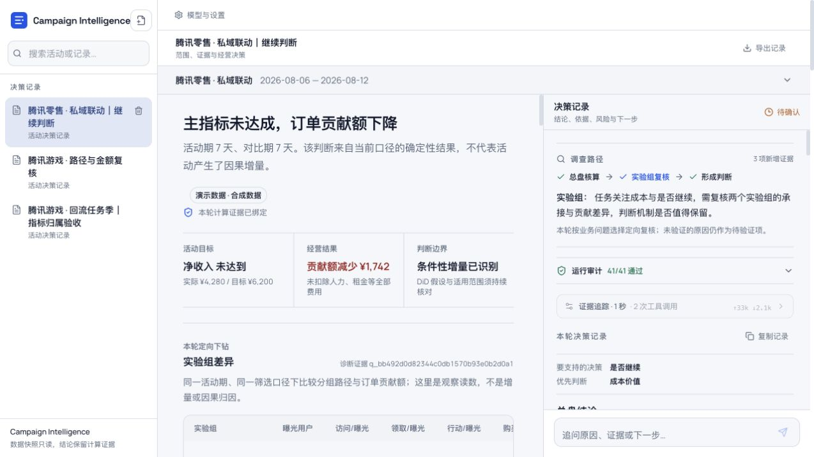
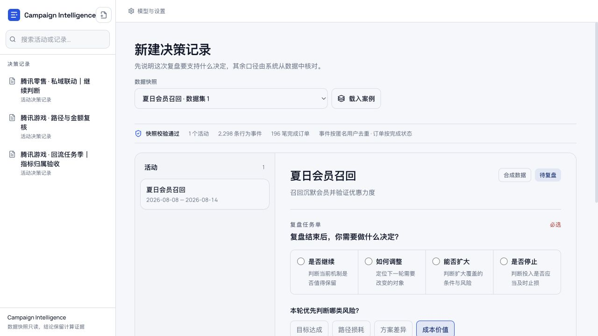
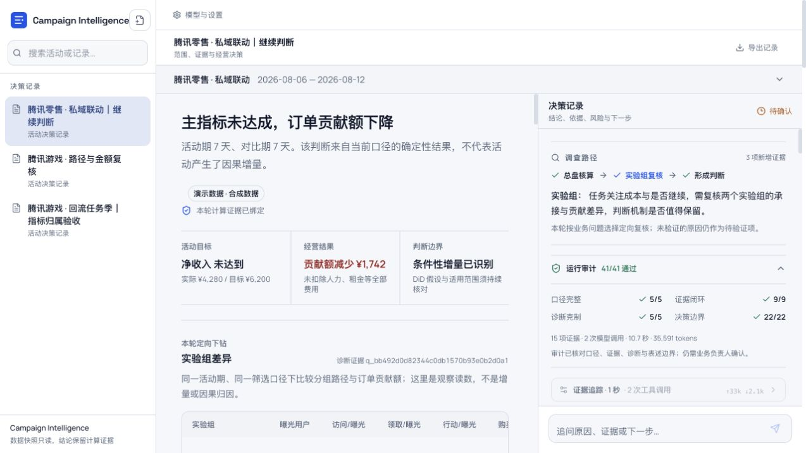
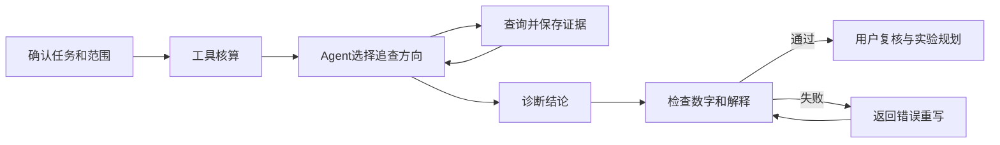

# Campaign Intelligence

面向零售及本地生活运营人员的营销活动复盘 Agent。将行为、交易和费用数据按统一口径核算，从目标达成、转化路径和经营贡献定位异常，辅助判断活动应继续、调整还是停止。

[产品设计](docs/product/01-product-brief.md) · [Agent 设计](docs/product/03-agent-design.md) · [问题与修复](docs/product/07-reviewer-guide.md) · [评测记录](docs/product/04-evaluation-plan.md)

## 产品演示

分析报告包含目标核验、两期经营比较、转化路径、分层诊断及实验规划。结论中的关键数字可回查对应的计算结果、筛选条件和查询记录。



<details>
<summary>查看任务配置和执行检查</summary>




</details>

截图来自实际应用；演示使用合成数据，诊断来自保存的模型运行记录，不代表真实企业的活动结果。

## 复盘范围

| 分析内容 | 具体处理 |
|---|---|
| 目标达成 | 核对目标值、实际值和差额，统一活动期、对比期、退款及归因窗口口径 |
| 转化路径 | 按同一用户的事件顺序串联曝光至购买，计算相邻阶段转化率，定位主要断点 |
| 经营贡献 | 比较订单规模、单均贡献、优惠和活动费用，区分销售增长与贡献额改善 |
| 分层差异 | 检查渠道、人群、经营点及活动版本，识别总盘汇总掩盖的局部异常 |
| 后续验证 | 根据选定群体的历史转化率、预期提升幅度和流量测算实验规模，保存干预方案及复查安排 |

贡献额变化采用订单规模和单均贡献的对称分解，展示各项变化对结果的算术贡献，再追查优惠、直接成本及费用差异。分解结果用于定位调查方向，不替代原因验证；贡献额也不等于扣除租金、人力等全部费用后的净利润。

## Agent 设计

| 设计重点 | 实现方式 |
|---|---|
| 核算与判断分离 | 金额采用整数分，经营指标由参数化只读查询计算。Agent 使用工具结果分析异常，避免模型心算和自行变更公式 |
| 任务驱动的调查路径 | 将决策目标、优先风险和业务限制单独配置。Agent 读取趋势及分层扫描结果后选择最多三项定向复核，记录理由和证据，而非固定执行全部查询 |
| 统计范围与数据版本 | 每次查询绑定不可变快照、活动范围及指标版本。修改日期或筛选条件后重算，并标记原结论不适用于新范围 |
| 回答检查与错误修复 | 核对回答中的金额、证据引用、路径解释和因果表述。失败项连同对应指标返回模型，最多重写两次；仍未通过的回答不发布为最终结论 |



实验规划支持二元转化指标、固定样本和等比例分组，使用已保存的群体证据计算基线和可实验流量。增量分析采用可选同期面板 DiD，检查前趋势、活动前安慰剂及干扰条件；条件未满足时不输出因果增量结论。详细定义见[指标说明](docs/product/02-metric-contract.md)。

## 质量验证

评测分为数据与计算测试、执行轨迹检查和真实模型回归。54 条开发场景覆盖不同任务、筛选范围及活动机制；41 项自动检查核对工具调用、统计范围、数字引用、路径解释和因果表述。

真实模型回归保留逐轮失败记录。最新一轮 6 条代表场景通过全部检查，完整 54 场景尚未全部完成模型验证，因此不将该轮结果表述为稳定通过率。

| 发现的错误 | 具体改动 | 验证方式 |
|---|---|---|
| 将贡献额 3933 元写成 3393 元 | 按指标返回两期值和差额，检查回答后将错误数字反馈给模型 | 保留原始失败；一次模型重放通过当时 38 项检查 |
| 将路径完整性误解为行动后没有流失 | 独立返回阶段人数、相邻转化率和最低承接节点 | 查询测试及模型场景回归 |
| 将共享费用归给单一渠道 | 标明费用可归属范围，缺少明细时不计算分渠道投入效率 | 成本反例测试及回答检查 |

原始运行和失败记录见 [evals](evals/)，修改原因见[修复说明](docs/product/07-reviewer-guide.md)。自动检查用于发现已知错误，不替代业务人员复核。

## 运行说明

需要 Python 3.11+、uv、Node.js 20.19+ 和 pnpm。

```bash
git clone https://github.com/iloveme99i/campaign-intelligence-agent.git
cd campaign-intelligence-agent
uv sync --extra dev
cd frontend
pnpm install
pnpm build
cd ..
./scripts/run-merchant-local.sh
```

打开 `http://127.0.0.1:8101`，载入合成案例，在“模型与设置”中填写自己的 DeepSeek 或兼容 API 配置。密钥加密保存在本机，不要提交到仓库。示例文件及格式说明见 [sample_data](sample_data/)。

<details>
<summary>GitHub Codespaces 配置</summary>

仓库已提供 Codespaces 配置，但云端初始化尚未完成验收，不作为已上线 Demo。需要 GitHub 登录；实时诊断仍需自己的模型密钥。

[创建 Codespace](https://codespaces.new/iloveme99i/campaign-intelligence-agent?quickstart=1)

</details>

## 实现范围

本项目为个人产品项目，领域改动覆盖复盘任务设计、数据导入规范、指标核算、诊断工具、分析界面、实验规划及评测规则。各模块的设计取舍、代码位置和验证记录见[贡献说明](docs/product/05-build-ownership.md)。模型通过 API 调用，不涉及训练。

当前为单机单用户版本，未接入企业数据仓库和权限系统；没有真实商家上线结果或经营收益验证。项目展示以可运行功能、查询证据和回归记录为准。

## 许可证

采用 [Apache-2.0](LICENSE)。代码归属及第三方声明见 [NOTICE](NOTICE)，保留相关版权和许可证要求。
