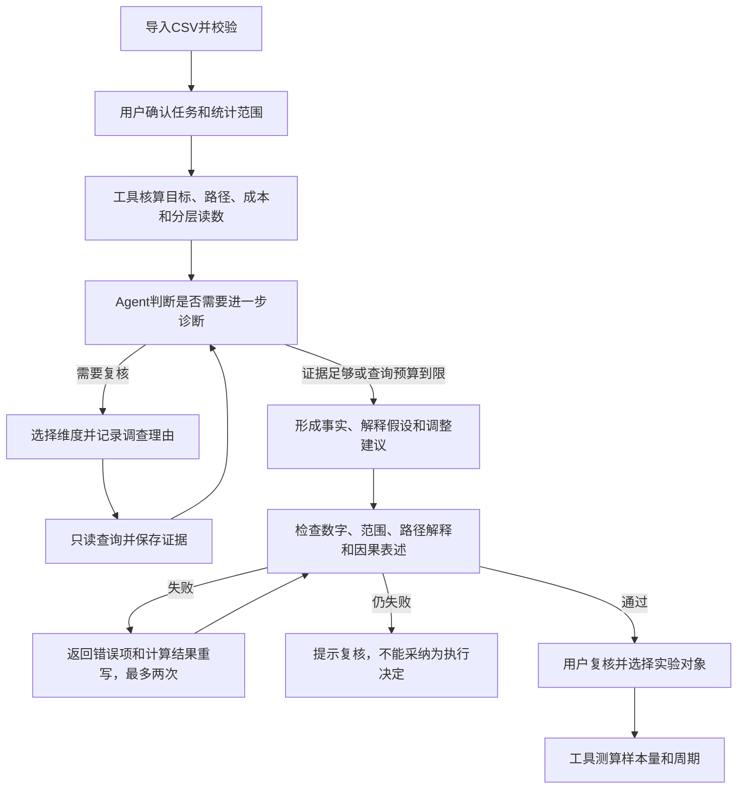

# Campaign Intelligence

[](https://github.com/iloveme99i/campaign-intelligence-agent/actions/workflows/ci.yml)
[](LICENSE)
[](pyproject.toml)
[](frontend/package.json)

面向零售及本地生活运营人员的营销活动复盘 Agent。核算活动目标、转化路径和投入成本，根据异常选择渠道、人群或经营点深入分析，解决统计口径不统一、异常难定位、结论难复查的问题。

当前项目是本地单用户版本，数据和示例均不代表真实业务收益。

## 产品演示

以下为实际应用截图，业务数据全部合成，诊断来自已保存的模型运行记录。


<details><summary>任务配置和执行检查</summary>


</details>

## 核心功能

- 统一计算活动目标、顺序转化路径、两期经营结果和投入成本。
- 根据任务和中间结果选择分析方向，记录为什么调用该诊断工具。
- 按渠道、人群、经营点和活动版本查看差异，关键数字可回查查询结果。
- 选择实验对象和主指标后测算样本量、预计周期；不把观察性差异当作随机实验效果。

## 产品流程和Agent架构



LangGraph工具调用基础继承自上游；本项目增加活动核算、范围绑定、诊断选择和质量检查逻辑。工具报错记录为失败事件，不当作计算结果引用。每次查询保存数据快照、指标版本、SQL和参数。口径修改后重新计算，历史记录保留但不能直接用于新范围。

## 评测和错误修复

54条开发场景覆盖决策目标、风险重点、筛选范围和不同活动机制；41项自动检查覆盖调用顺序、参数、数字引用、路径解释和因果边界。它们不是线上用户数量或专家事实正确率。

金额转录、漏斗误读、共享费用归属三类案例详见[问题及修复记录](docs/product/07-reviewer-guide.md)。[最新6条代表场景记录](evals/representative-suite-run-2026-09-16-v8.json)通过当轮检查，历史失败也保留在仓库，不据此宣称稳定通过率。

## 快速体验

[](https://codespaces.new/iloveme99i/campaign-intelligence-agent?quickstart=1)

提供 Codespaces 配置，初始化后自动启动8101端口（需要GitHub登录，云端初始化尚未验收）。点击“载入案例”导入合成数据。生成实时Agent记录需要在设置页填写自己的OpenAI-compatible API Key；没有Key时可先浏览上方真实截图和评测记录。项目不会把Key写入仓库。

不使用 Codespaces 时，可按下方“本地运行”在自己的电脑启动。当前没有托管生产服务，避免把个人模型密钥暴露在公共站点，也不把预先写好的静态页面冒充实时 Agent。

## 一次完整复盘

1. 导入活动配置、匿名行为事件、交易结果和活动成本四份必需 CSV；有稳定同期经营单元时可另加一份增量面板。
2. 先定义要支持的经营决策与优先风险，生成可追踪的 `task_id`，不让 Agent 在不明确任务时自由发挥。
3. 选择活动，确认活动期、等长对比期、人群、渠道、经营点和退款口径。
4. 系统先用受限只读查询确定性计算目标结果、漏斗、实验差异与活动成本。
5. 系统先扫描两期走势与实验组、渠道、经营点和人群，Agent 再结合决策任务和业务限制选择最多三项必要的定向复核；每次诊断记录业务理由、独立证据与查询口径。
6. Agent 在证据足够时停止扩展查询，将事实、解释假设、待验证项和下一轮停止/继续条件分层输出。
7. 使用者明确选择下一轮实验对象、具体分组与主指标，系统用该群体的已保存证据计算每组样本量和预计周期；MDE 与实验流量由使用者确认，随机化、SRM、串组和贡献额护栏仍作为上线前检查项。
8. 负责人确认行动后，系统将复查日期与当前 `scope_id`、回答摘要绑定；口径变更不会覆盖旧记录。

## 为什么这里需要 Agent

固定报表能展示指标，但真实复盘的追查路径会随结果变化：目标未达成时先拆路径，路径改善但贡献下降时转向优惠和投放成本，实验组差异明显时还要检查样本与因果边界。Agent 负责选择下一步查询和组织判断；金额、用户数、转化率等事实不交给模型心算。

```text
复盘口径
   │
   ├── 只读快照 + 参数化查询 ──> 目标 / 路径 / 实验 / 成本证据
   │                                  │
   └──────────────────────────────> Agent 解释与追查
                                      │
                                      └── 事实 / 假设 / 待验证项
```

## 关键工程约束

- 快照按输入内容生成 SHA-256 标识，发布后只读。
- SQL 由业务工具生成并绑定参数；模型不能写库或绕过查询预算。
- 金额使用整数分。`net_revenue` 不扣平台承担优惠；`contribution` 仍未覆盖租金、人力等全部经营费用，不等于净利润。
- 行为节点按匿名用户统计；`exposure`、`landing_view`、`offer_claim`、`activation` 分别代表触达、进入、权益领取/任务接受和业务关键行动，均按 `user_key` 去重。
- 前后周期变化只说明相关变化，不能单独证明活动因果效果。
- 实验读数提供两比例检验、置信区间和小样本检查；导入数据无法证明随机分流，因此不会把统计差异写成因果结论。
- 可选同期面板执行平衡面板 DiD，并强制检查稳定构成、前趋势、活动前安慰剂和干扰审查；未通过时只展示诊断，不输出因果增量。
- 下一轮实验使用当前证据中的基线转化率与日均可实验流量，按固定样本、双侧两比例检验和 50/50 分组确定性测算；默认展示值只是可编辑规划假设，不冒充业务阈值。
- 合成示例在界面中明确标注为“合成数据”，不用于声明真实效果。

## 数据契约

| 文件 | 必需内容 | 主要用途 |
|---|---|---|
| `campaigns.csv` | 活动目标、周期、主指标、目标值、归因窗口 | 建立复盘口径 |
| `events.csv` | 匿名用户、事件时间、节点、实验组、渠道、人群 | 用户路径与实验漏斗 |
| `orders.csv` | 完成订单、金额、优惠、退款、直接成本 | 经营结果与贡献额 |
| `costs.csv` | 日期、实验组、渠道、成本类型、金额 | 活动投入核算 |

详细字段可从首页下载空白模板；导入器会校验 UTF-8、表头、主外键、日期范围、金额非负、活动曝光唯一性和文件大小。

## 本地运行

需要 Python 3.11、Node.js 20.19+ 和 pnpm。

```bash
git clone https://github.com/iloveme99i/campaign-intelligence-agent.git
cd campaign-intelligence-agent
uv sync --extra dev
cd frontend
pnpm install
pnpm build
cd ..
./scripts/run-merchant-local.sh
```

打开 `http://127.0.0.1:8101`。首次可选择“打开跨业务合成案例”，其中包含字节系全域大促、腾讯游戏回流任务和腾讯智慧零售私域联动三种公开机制原型；随后在“模型与设置”中选择 `DeepSeek / 兼容 API`，使用 DeepSeek 官方预设，并在本机填写自己的 API Key。密钥加密保存在本地数据库，不要提交到仓库。

## 测试与评测

```bash
LC_ALL=en_US.UTF-8 LANG=en_US.UTF-8 .venv/bin/python -m pytest tests/merchant -q
.venv/bin/ruff check backend/src/analytics_agent/merchant tests/merchant
cd frontend && pnpm test && pnpm build
```

`evals/merchant_review_cases.jsonl` 是由脚本生成并校验的 54 场景 Agent 评测矩阵；`scripts/run-merchant-eval-suite.py` 可先免费验证覆盖结构，再显式调用真实模型执行整套用例。每次运行读取持久化 trace，核对工具顺序、诊断方向、必答主题和 41 项质量门。单个会话仍可用 `scripts/score-merchant-trace.py <conversation_id>` 直接评分。

已使用项目所有者本机配置的 DeepSeek 官方 API 完成开发验收。失败样本覆盖证据漏引、金额单位、路径语义、伪因果、无条件预测、共享费用错误归属、内部字段泄漏、ATT 估计对象含糊和前趋势检验力过度解读；每次问题都被固化为确定性门禁或回归测试。2026-09-16 的腾讯零售合成案例使用四指标平衡面板 DiD，2 次模型调用、10.706 秒、35,591 tokens，运行时通过当时 39/39 门禁且未触发补写；同一持久化记录按当前代码回放为 41/41。回答明确将 ATT 限定为单个处理经营单元的活动后周期均值效应，并说明 3 个前期的前趋势检验力有限。详见 [`evals/smoke-incrementality-2026-09-16.json`](evals/smoke-incrementality-2026-09-16.json)。它只是一条合成场景单次证据，不是稳定通过率或线上效果。API Key 不写入仓库。

产品决策与深挖材料见 [`docs/product/01-product-brief.md`](docs/product/01-product-brief.md)、[`02-metric-contract.md`](docs/product/02-metric-contract.md)、[`03-agent-design.md`](docs/product/03-agent-design.md)、[`04-evaluation-plan.md`](docs/product/04-evaluation-plan.md)、[`05-build-ownership.md`](docs/product/05-build-ownership.md) 和 [`06-public-scenario-benchmarks.md`](docs/product/06-public-scenario-benchmarks.md)。这些文档明确标出尚未验证的假设，不用虚构访谈或线上效果填充项目故事。

## 当前边界

- 单机、单用户；尚未接企业数据仓库与权限系统。
- 只支持结构化 CSV 快照，不把真实顾客姓名、手机号等个人信息作为输入。
- 当前 A/B 判断与样本量规划只覆盖二元转化率、固定样本和等比例分组；DiD 只覆盖平衡面板、单元等权 ATT、Welch–Satterthwaite 小样本 t 推断、线性前趋势与活动前安慰剂，尚未覆盖多重检验、序贯检验、聚类稳健标准误、倾向得分匹配和长期留存观察。
- 真实 DeepSeek 场景仍需扩展到每个用例至少 3 次，并在更多数据规模下建立稳定性、延迟和实际账单成本基线。

## 来源与许可证

这是个人产品实践项目，不涉及模型训练。项目新增范围包括需求定义、复盘流程、领域工具、交互界面和评测；通用基础设施来自下述开源基座。代码实现使用AI辅助，新增模块不等同于全部代码独立手写。具体设计取舍和验证位置见[贡献范围](docs/product/05-build-ownership.md)。

```text
backend/src/analytics_agent/merchant/  活动核算、数据契约、证据和评测
backend/src/analytics_agent/agent/     通用编排及模型调用（含上游能力）
frontend/src/components/Chat/         复盘界面和诊断结果
sample_data/                         可重建的合成CSV
evals/                               开发场景和真实模型回归记录
docs/product/                        产品说明和设计取舍
tests/merchant/                      活动领域测试
```

项目基于 `datahub-project/analytics-agent` 的 Apache-2.0 代码基线（提交 `466e8ab3db967450db9578c7f649925f96e3de8c`）进行领域重构，保留原许可证与版权声明。商家活动数据契约、只读快照、分析口径、确定性比较工具、证据链、评测门和 Agent 界面为本项目新增或重写部分。

当前发行身份为 `campaign-intelligence`；上游名称只用于许可证归属和代码基线说明，不再作为产品 API、前端包或安装元数据名称。
